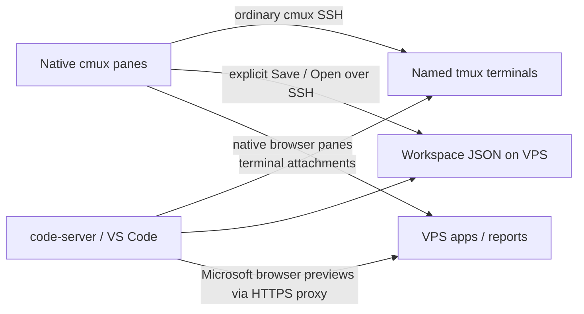

# VPS Workspaces

Keep native **cmux** terminal and browser panes on your Mac. Save their arrangement on your own VPS. Reopen them from another Mac, or share a private link with the same running terminals, project files, and browser previews inside **code-server (VS Code in your browser)**.

An experimental integration of existing tools: **cmux + tmux + code-server + Caddy**. No custom terminal emulator, browser engine, cmux build, or cloud workspace provider.

> Working prototype, not a general-purpose hosted collaboration platform. Native and web panes work; cmux's installed SSH relay rejects remote browser automation commands. See [verification and limitations](docs/VERIFICATION.md).

## How it works



- **One sidebar workspace**, containing native cmux terminal/browser panes.
- **Explicit Save/Open:** layouts, split proportions, tabs, browser URLs, and named tmux sessions. A stale save is rejected instead of silently overwriting another Mac's changes.
- **One stable HTTPS link per saved workspace.** When code-server is enabled, the link opens its VS Code workbench. Saved panes become editor groups, named tmux terminals, and independent browser previews. The original ttyd page remains at `/classic/`.
- **Same live terminal:** input from any attached client reaches the same shell/agent. Coordinate typing with collaborators.
- **Independent browsers:** each viewer opens a fresh browser instance at the saved URL. Cookies, scrolling, and unsaved forms are not synchronized.
- **Mac can disconnect:** tmux and VPS services remain running. Rebooting the VPS ends terminal processes; resume agents afterward.

## Quick start

This initial deployment targets a Linux VPS with systemd, key-based SSH, and an existing **rootless Docker Caddy** reverse proxy. It expects `~/deploy/caddy/sites` to be imported by `/etc/caddy/Caddyfile`, and `~/deploy/www` to be mounted at `/srv` in the `caddy` container. See [code-server setup](docs/IDE.md) and [installation](docs/INSTALL.md) for exact prerequisites and adaptation points.

Once installed, from a **local Mac terminal inside cmux**:

```sh
python3 workspace.py open demo
python3 workspace.py save demo
python3 workspace.py link demo
```

The default SSH alias is `myvps`; set `VWS_SSH_HOST` to change it. Start a coding agent normally in the resulting terminal. New browser panes can be created using cmux itself, then saved. Add another persistent terminal with:

```sh
python3 workspace.py add-terminal demo second-agent
```

A running agent outside tmux is not captured by attaching tmux. Exit the original agent normally and resume its saved conversation in the new shared terminal; do not run concurrent copies of the same conversation.

## What is in this repository

| File | Purpose |
|---|---|
| `workspace.py` | Mac Save/Open/list/link/add-terminal CLI using cmux's existing control API |
| `remote.py` | SSH-only registry, revision checks, Caddy route generation, tmux attachment |
| `server.py` | Authenticated layout and HTTP/WebSocket adapter in front of ttyd and local apps |
| `ide-extension/` | cmux layout integration using Microsoft Simple Browser and adapted Workspace Layout terminal code |
| `install-ide.py` | Per-workspace code-server service and workspace configuration |
| `static/` | Link entry and fallback ttyd page |
| `cmux-relay.py` | Refresh connection metadata for supported cmux relay commands |
| `install-server.py` | Private runtime state and systemd user service installation |
| `cmux-diagnostic.py` | Read-only local cmux capability/layout diagnostics |
| `verify-native.py` | Manual native Save/Open integration verification (defaults to Outreach) |
| `tests/` | Authentication boundaries and document validation tests |

Runtime JSON, link keys, session cookies, and relay credentials belong under `~/.local/share/vps-workspaces` on the VPS and `~/.local/state/vps-workspaces` on the Mac. They are not included here.

## Upstream work

The design was informed by cmux's Remote tmux source and these related PRs:

- [#8116 — Persist remote runtime session state](https://github.com/manaflow-ai/cmux/pull/8116)
- [#9861 — Browser beside remote tmux mirrors](https://github.com/manaflow-ai/cmux/pull/9861)
- [#12706 — Connected Workspaces sync](https://github.com/manaflow-ai/cmux/pull/12706)
- [#8417 — Authenticated multiplayer workspace sharing](https://github.com/manaflow-ai/cmux/pull/8417)
- [#11514 — Web bridge for live Mac sessions](https://github.com/manaflow-ai/cmux/pull/11514)

See [upstream research](docs/UPSTREAM.md) for each PR's relevance, checked status, source references, and the distinction between inspiration and reused code. This project is independent of cmux and does not incorporate those PR branches.

## Development

Python 3.10+ on the Mac, Python 3.12 tested on the VPS. The Mac CLI uses the standard library; the server uses aiohttp.

```sh
python3 -m venv .venv
.venv/bin/pip install -r requirements.txt
.venv/bin/python -m unittest discover -s tests -v
```

Read [architecture](docs/ARCHITECTURE.md), [work log](docs/WORKLOG.md), and [verification](docs/VERIFICATION.md) before changing connection routing or authentication.
