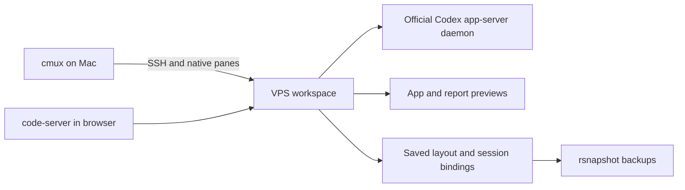

# VPS Workspaces

**Your cmux workspace, backed by a VPS—and available in a browser.**

Keep native terminal and browser panes on your Mac. Reopen the same coding session from
another device, or open its link in a familiar VS Code workbench. The official Codex daemon
supplies shared conversations; cmux and code-server supply independently sized interfaces.

[Get started](docs/INSTALL.md) · [Commands & maintenance](docs/MAINTENANCE.md) ·
[Architecture](docs/ARCHITECTURE.md) · [For agents](AGENTS.md) ·
[Verified behavior & limits](docs/VERIFICATION.md) · [Server migration](docs/MIGRATION.md)

## What you get

- **Native cmux on the Mac.** SSH terminals and browser panes, with their saved arrangement.
- **VS Code in the browser.** code-server opens project files, terminals and web previews.
- **One shared Codex engine.** The official daemon serves independent native terminal clients.
- **Automatic layout saves.** Split proportions, tabs, URLs and session bindings persist;
  conflicting edits pause with a recovery draft.
- **A stable workspace link.** Create a managed workspace and retrieve its link from the CLI
  or cmux's **Copy Browser Workspace Link** action.
- **Versioned backups.** rsnapshot handles retention; SQLite's backup API prepares consistent
  database copies. Mac and VPS snapshots are unencrypted.

This is an experimental integration of existing tools, not a new terminal emulator or IDE.
The current deployment targets macOS plus a Linux systemd VPS with the documented rootless
Docker Caddy setup. Sharing links grant a VPS terminal and are for trusted collaborators.

## Start using it

Complete the [installation guide](docs/INSTALL.md) first. Then, from a **local Mac terminal
inside cmux**, in your checkout:

```sh
python3 workspace.py install cmux
python3 workspace.py new my-project --cwd '~/Coding/my-project'
```

The VPS directory must already exist. Creation provisions its browser IDE and native Codex conversation,
opens the native workspace, and prints the link. The cmux palette also offers **New VPS Workspace**.

```sh
python3 workspace.py open my-project       # attach another native viewer
python3 workspace.py link my-project --copy
python3 workspace.py autosave-status
```

The default SSH alias is `myvps`; override it with `VWS_SSH_HOST`. For automatic persistence,
run `python3 workspace.py persistence install` on both machines after base setup. Normal new
cmux workspaces then become VPS workspaces, and terminal tabs use persistent tmux sessions.
See [automatic persistence](docs/AUTOSAVE.md) for permissions, recovery and the local opt-out.

## How the pieces fit



Browser cookies, form contents and Post Studio drafts stay in each browser; saving a layout
saves its URL, not that browser's storage. Native Codex panes fit each viewer independently.
Ordinary shared tmux shells still have one underlying terminal size. cmux's SSH relay currently
rejects remote browser automation commands.

## Repository guide

| Path | Purpose |
|---|---|
| `workspace.py` | Main CLI: workspaces, links, diagnostics and installation |
| `remote.py` | Stable SSH entry point |
| `vps_workspaces/` | Typed Python integration modules and installers |
| `ide-extension/` | Typed VS Code adapter using upstream browser and terminal helpers |
| `deploy/` | Service templates |
| `examples/` | A reusable saved layout |
| `tests/` | Regression and integration checks |
| `docs/` | Setup, operations, verification and design history |
| `vendor/` | Attributed standalone upstream tooling |

Runtime state, private links, credentials and session databases stay outside the repository.
See [AGENTS.md](AGENTS.md) for the code map and [maintenance](docs/MAINTENANCE.md) for deployment
and recovery. Project code is MIT; vendored components retain their included licenses.

## Upstream work

Built on **cmux, Codex, tmux, code-server, Caddy and rsnapshot**. The extension reuses Microsoft's
Simple Browser and Jonathan Carter's Workspace Layout helper. cmux's own settings editor
handles JSONC configuration; Zod validates extension input.

Legacy HAPI adapters remain temporarily for existing registry migrations; new workspaces
do not use HAPI or inject its tools/prompts. See [native Codex](docs/CODEX.md).

Related cmux pull requests that informed the design:

- [#8116 — Persist remote runtime session state](https://github.com/manaflow-ai/cmux/pull/8116)
- [#9861 — Browser beside remote tmux mirrors](https://github.com/manaflow-ai/cmux/pull/9861)
- [#12706 — Connected Workspaces sync](https://github.com/manaflow-ai/cmux/pull/12706)
- [#8417 — Authenticated multiplayer workspace sharing](https://github.com/manaflow-ai/cmux/pull/8417)
- [#11514 — Web bridge for live Mac sessions](https://github.com/manaflow-ai/cmux/pull/11514)

See [source attribution](docs/UPSTREAM.md), the [reuse audit](docs/REUSE-AUDIT.md), and
[extension notices](ide-extension/NOTICE.md). This project is independent of cmux;
those PR branches are references, not incorporated patches.

## Development

Use `uv` with Python 3.12 on both machines; the dependency-free Mac entry points also support system Python 3.9. Extension development: Node.js 22.

```sh
uv sync --locked
uv run mypy
uv run ruff check
uv run python -m unittest discover -s tests -v
cd ide-extension
npm ci --ignore-scripts
npm test
```

The extension's deployment bundle is committed. `npm test` checks types and formatting,
rebuilds it, and runs the layout tests. CI checks that the committed bundle matches its source.
For changes affecting running workspaces, follow the [deployment checklist](docs/MAINTENANCE.md#update-or-roll-back).

### Tool resource isolation

The optional [AgentCgroup adapter](docs/AGENTCGROUP.md) automatically places Codex Bash
tool commands in separately limited cgroups for existing full-access configurations. It reuses and attributes
[eunomia-bpf/agentcgroup](https://github.com/eunomia-bpf/agentcgroup); upstream source and
GPL-2.0 notices are preserved. The deployed adapter uses standard cgroup v2, not the
experimental eBPF scheduler or patched-kernel memory controller.
